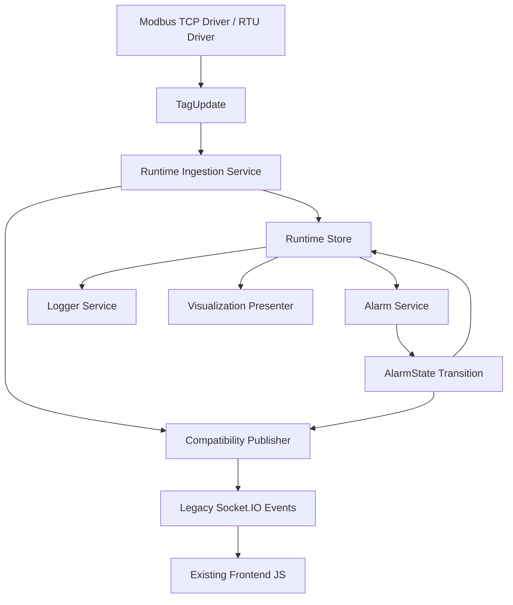

# Incremental Refactor Blueprint for Modbus Monitor Webserver

## Scope

Tai lieu nay gom du ca 3 phan sau trong mot ke hoach thong nhat:

1. Blueprint chi tiet cho Runtime Store va Compatibility Publisher.
2. Bang mapping day du tu 8 card type hien tai sang CardSchema chuan hoa.
3. Ke hoach refactor theo tung PR nho, an toan, co chi ro file can sua truoc.

Muc tieu cua tai lieu la refactor noi bo kien truc ma khong lam thay doi:

- Database schema hien co va du lieu hien co.
- API contract hien co.
- Socket.IO event names hien co.
- Alarm behavior, logger behavior, report behavior.
- UI layout, DOM identity quan trong, CSS classes quan trong va luong thao tac cua nguoi dung.

## Existing Architecture Assessment

He thong hien tai da co phan tach process tot, nhung domain boundary chua ro rang.

### Strengths

- Web, worker va DB da tach process, thuan loi cho refactor tang dan.
- Alarm da co tien de strategy/factory trong [workers/alarm_strategies.py](workers/alarm_strategies.py).
- Card condition da duoc hop nhat mot phan vao bang `card_alarm_conditions` trong [webapp/modbus_monitor/database/db.py](webapp/modbus_monitor/database/db.py#L646).
- Runtime data thuc te da co "nguon su that" ngam dinh qua `tag_latest_values`, `card_alarm_states`, `quad_alarm_states` trong [webapp/modbus_monitor/database/db.py](webapp/modbus_monitor/database/db.py).
- Frontend da co co che socket room theo subdashboard trong [webapp/app.py](webapp/app.py#L85) va [webapp/static/js/subdashboard-detail.js](webapp/static/js/subdashboard-detail.js#L3661).

### Main Architectural Debt

- Driver layer chua thuan driver: worker TCP/RTU vua doc Modbus, vua persist DB, vua emit realtime payload cu trong [workers/tcp_worker.py](workers/tcp_worker.py#L413).
- Visualization layer dang hardcode theo card type o route, template partial va JS selector.
- Alarm layer van phu thuoc card type thong qua strategy concretions.
- Formatting bi duplicate giua Jinja, frontend JS va logger worker.
- Tag model van gan voi Modbus thay vi signal abstraction.

## Coupling Analysis

### 1. Card-Type Coupling

Card type hien dang xuyen suot qua nhieu tang:

- DB access: `get_qtag6_cards_for_group`, `get_qtag4_cards_for_group`, `get_qtag3_cards_for_group`, `get_qtag2_cards_for_group`, `get_qtag_single3_cards_for_group`, `get_qtag_pv_cards_for_group`, `get_qtag_pv_dual_cards_for_group` trong [webapp/modbus_monitor/database/db.py](webapp/modbus_monitor/database/db.py#L3929).
- Route loading: cac nhanh load rieng theo tung card trong [webapp/modbus_monitor/subdashboards/routes.py](webapp/modbus_monitor/subdashboards/routes.py#L113).
- Template rendering: partial rieng nhu [webapp/templates/subdashboards/_qtag6_cards.html](webapp/templates/subdashboards/_qtag6_cards.html).
- Frontend realtime: selector update rieng cho tung card trong [webapp/static/js/subdashboard-detail.js](webapp/static/js/subdashboard-detail.js#L3224).
- Alarm evaluation: strategy registry trong [workers/alarm_strategies.py](workers/alarm_strategies.py).

Tac dong hien tai: muon them card moi phai sua o DB loader, route, template partial, JS realtime, alarm strategy, condition UI va test contract.

### 2. Runtime Coupling

Runtime state dang bi truy cap truc tiep tu nhieu module:

- Worker ghi truc tiep vao `tag_latest_values`.
- Alarm worker doc truc tiep tu `get_latest_tag_value` trong [workers/alarm_worker.py](workers/alarm_worker.py#L981).
- Logger worker doc truc tiep tu `get_latest_tag_values_batch` trong [workers/logger_worker.py](workers/logger_worker.py#L93).
- Web route/doc render doc truc tiep gia tri moi nhat tu DB loader card.

Hau qua: khong co mot abstraction chung de sau nay dua MQTT, OPC-UA, derived tags hay trend engine vao.

### 3. Event Coupling

Payload su kien ra ben ngoai hien dang duoc sinh o nhieu noi va gan chat voi UI contract:

- `modbus_update` va `tag_update` trong [webapp/app.py](webapp/app.py#L61).
- `alarm_event` trong [workers/alarm_worker.py](workers/alarm_worker.py#L1065).
- `card_alarm_event` va `quad_alarm_event` duoc frontend lang nghe truc tiep trong [webapp/static/js/subdashboard-detail.js](webapp/static/js/subdashboard-detail.js#L3515).

Hau qua: noi dung event hien la compatibility contract, nhung chua co lop chuan hoa ben trong.

### 4. Formatting Coupling

Formatting rules dang lap lai o 3 noi:

- Jinja filters trong [webapp/modbus_monitor/__init__.py](webapp/modbus_monitor/__init__.py#L151).
- Frontend realtime formatter trong [webapp/static/js/subdashboard-detail.js](webapp/static/js/subdashboard-detail.js#L1402).
- Logger formatter trong [workers/logger_worker.py](workers/logger_worker.py#L139).

Day la rui ro truc tiep cho yeu cau giao dien, log export va report phai giong nhau.

## Proposed Folder Structure

Khong doi toan bo repo ngay. Them cac package moi de lam canonical layer, sau do chuyen dan consumer.

```text
shared/
  domain/
    alarms.py
    cards.py
    events.py
    formatting.py
    tags.py
  runtime/
    interfaces.py
    mysql_store.py
    cache.py
    snapshots.py
  drivers/
    base.py
    modbus_tcp_driver.py
    modbus_rtu_driver.py
  services/
    alarm_service.py
    calculation_service.py
    compatibility_publisher.py
    formatting_service.py
    logger_service.py
    runtime_ingestion_service.py
  compat/
    legacy_alarm_events.py
    legacy_card_presenters.py
    legacy_socket_payloads.py

webapp/modbus_monitor/
  repositories/
    alarm_repository.py
    card_repository.py
    runtime_repository.py
    tag_repository.py
  visualization/
    card_schema_registry.py
    presenters.py
    view_models.py

workers/
  runners/
    alarm_runner.py
    driver_runner.py
    logger_runner.py
```

### Migration Rule for Folder Structure

- Khong doi ten module hien tai o pha dau.
- Package moi song song voi code cu.
- Code cu goi adapter moi truoc khi code moi thay the code cu.

## New Domain Model Design

### Tag Domain

```python
class TagDefinition:
    id: int
    name: str
    source_driver: str
    source_ref: dict
    datatype: str
    scale: float
    offset: float
    unit: str | None
    metadata: dict


class TagState:
    tag_id: int
    value: float | int | str | None
    quality: str
    timestamp: datetime
    formatted_value: str | None
```

### Alarm Domain

```python
class AlarmRule:
    id: str
    subject_ref: str
    operator: str
    compare_type: str
    target_value: float | None
    target_ref: str | None
    on_stable_sec: int
    off_stable_sec: int
    severity: str
    channels: dict
    description: str | None


class AlarmState:
    subject_ref: str
    status: str
    alarm_type: str
    triggered_at: datetime | None
    cleared_at: datetime | None
    pv_value: float | None
    threshold: float | None
    operator: str | None
```

### Visualization Domain

```python
class CardSchema:
    schema_id: str
    legacy_type: str
    layout: str
    columns: list[dict]
    visual_tokens: dict
    bindings: dict


class CardInstance:
    id: int
    schema_id: str
    legacy_type: str
    title: str | None
    group_id: int
    config: dict
```

### Event Domain

```python
class TagUpdate:
    tag_id: int
    value: float | int | str | None
    quality: str
    timestamp: datetime
    source_driver: str


class RuntimeEvent:
    event_type: str
    subject_ref: str
    payload: dict
    timestamp: datetime
```

## Runtime Store Blueprint

### Design Goal

Runtime Store la single source of truth cho runtime state, nhung khong doi bang hien co o pha dau.

### Interface

```python
class RuntimeStore:
    def upsert_tag_state(self, update: TagUpdate) -> None: ...
    def get_tag_state(self, tag_id: int) -> TagState | None: ...
    def get_tag_states(self, tag_ids: list[int]) -> dict[int, TagState]: ...
    def upsert_device_status(self, device_id: int, status: str, timestamp: datetime) -> None: ...
    def upsert_alarm_state(self, alarm_state: AlarmState) -> None: ...
    def clear_alarm_state(self, subject_ref: str) -> None: ...
    def get_alarm_state(self, subject_ref: str) -> AlarmState | None: ...
    def append_event(self, event: RuntimeEvent) -> None: ...
```

### Initial Implementation

Pha dau Runtime Store chi la facade tren bang hien co:

- `tag_latest_values` cho `TagState`.
- `devices.is_online` va `devices.updated_at` cho device connectivity.
- `card_alarm_states` cho non-quad card alarm state.
- `quad_alarm_states` cho quad legacy state.
- `alarm_events` cho persisted history.

### Storage Strategy

- MySQL la persistent runtime backend lien process.
- Moi worker co local cache TTL nho de giam query.
- Khong can them Redis hay rewrite IPC o pha dau.

### Why This Fits the Current Repo

- Alarm worker hien da doc tu DB runtime o [workers/alarm_worker.py](workers/alarm_worker.py#L981).
- Logger worker hien da doc tu batch latest values o [workers/logger_worker.py](workers/logger_worker.py#L93).
- Card loaders hien cung su dung latest values o [webapp/modbus_monitor/database/db.py](webapp/modbus_monitor/database/db.py#L3929).

Do do, facade nay co the chen vao ma khong thay doi hanh vi ngoai.

## Compatibility Publisher Blueprint

### Design Goal

Lop nay nhan canonical event noi bo va phat lai dung payload legacy ma frontend va API dang phu thuoc.

No la ban nang cap thuc su cua stub hien tai trong [webapp/modbus_monitor/services/socket_emission_manager.py](webapp/modbus_monitor/services/socket_emission_manager.py).

### Responsibilities

- Nhan `TagUpdate` va phat lai `modbus_update`, `tag_update`.
- Nhan `AlarmState` transition va phat lai `alarm_event`, `card_alarm_event`, `quad_alarm_event`.
- Giu event name y nguyen.
- Giu field names payload y nguyen.
- Dinh tuyen room Socket.IO y nguyen.

### Internal Components

```python
class CompatibilityPublisher:
    def publish_tag_update(self, update: TagUpdate, context: dict) -> None: ...
    def publish_simple_alarm(self, alarm_state: AlarmState, context: dict) -> None: ...
    def publish_card_alarm(self, alarm_state: AlarmState, context: dict) -> None: ...
    def publish_quad_alarm(self, alarm_state: AlarmState, context: dict) -> None: ...
```

### Legacy Contracts to Preserve

#### Tag Update Contracts

- `modbus_update`
- `tag_update`

Current frontend contract dang dung o [webapp/static/js/subdashboard-detail.js](webapp/static/js/subdashboard-detail.js#L3224).

#### Alarm Contracts

- `alarm_event` cho simple tag alarms.
- `card_alarm_event` cho qtag6, qtag4, qtag3, qtag2, single3, pv_only, pv_dual.
- `quad_alarm_event` cho quad legacy card.

Current frontend contract dang dung o [webapp/static/js/subdashboard-detail.js](webapp/static/js/subdashboard-detail.js#L3515).

### Event Flow Design



### Room Routing Policy

Compatibility Publisher phai giu nguyen room policy hien tai:

- `subdashboard_{sid}`
- `dashboard_device_{device_id}`

Routing co the tai su dung logic hien co trong [webapp/app.py](webapp/app.py#L61), nhung duoc chuyen dan vao publisher de web app khong con la noi format payload business event.

## Formatting Service Design

### Goal

Mot noi dinh nghia display policy, nhieu noi su dung.

### Canonical Service

```python
class FormattingService:
    def format_tag_value(self, value, scale=None, offset=0, datatype=None) -> str: ...
    def format_fixed_value(self, value, decimal_places=None) -> str: ...
    def get_display_precision(self, scale) -> int | None: ...
```

### Existing Logic to Consolidate

- Jinja filter trong [webapp/modbus_monitor/__init__.py](webapp/modbus_monitor/__init__.py#L151).
- JS helpers trong [webapp/static/js/subdashboard-detail.js](webapp/static/js/subdashboard-detail.js#L1402).
- Logger formatter trong [workers/logger_worker.py](workers/logger_worker.py#L139).

### Compatibility Rule

- Output string phai giong hien tai.
- Khong doi cach lam tron o UI.
- Khong doi cach render fixed value.
- Frontend JS chi con goi display policy da inject, khong tu viet rule rieng.

## Schema-Driven UI Design

### Principle

Khong render metadata-driven tu ngay dau. Giai doan dau chi metadata-prepare, legacy-render.

### Target Flow


### CardSchema Registry

Moi card type hien tai duoc bieu dien nhu mot preset schema. Preset tra ve:

- `layout`
- `columns`
- `elements`
- `bindings`
- `visual_tokens`
- `alarm_subjects`

### Presenter Rule

Presenter phai sinh ra dung field ma template partial va JS hien tai dang can. Vi du:

- `tag1`, `tag2`, `tag3` van ton tai o giai doan chuyen tiep.
- `pv_tag`, `left_tag`, `right_tag` van ton tai voi card cu.
- `data-role="pv"`, DOM id pattern va CSS class phai giu nguyen.

## Card Mapping to Normalized CardSchema

### Normalized Schema Vocabulary

- `layout`: `single-stat`, `single-band`, `dual-band`, `dual-stat`, `dual-compare`
- `element.type`: `pv`, `sv`, `sv_high`, `sv_low`, `description`, `status_indicator`, `timestamp`
- `binding.kind`: `tag_ref` hoac `fixed_value`
- `column.id`: `left`, `right`, `single`

### Mapping Table

| Legacy card type | Current DB table | Normalized layout | Columns | Elements | Alarm subjects | Notes for compatibility |
| --- | --- | --- | --- | --- | --- | --- |
| `PV_ONLY` | `subdash_qtag_pv_cards` | `single-stat` | `single` | `pv`, `description`, `status_indicator`, `timestamp` | `card:pv_only:{id}:left` | Single PV card, exact DOM and color behavior must remain unchanged |
| `SINGLE3` | `subdash_qtag_single3_cards` | `single-band` | `single` | `pv`, `sv_high`, `sv_low`, `status_indicator`, `timestamp` | `card:single3:{id}:left` | SV may be fixed or tag, card-level alarm remains left-only |
| `QTAG2` | `subdash_qtag2_cards` | `single-band` | `single` | `pv`, `sv`, `status_indicator`, `timestamp` | `card:qtag2:{id}:left` | One PV with one SV, keeps current Qtag2 visual shell |
| `QTAG3` | `subdash_qtag3_cards` | `single-band` | `single` | `pv`, `sv_high`, `sv_low`, `status_indicator`, `timestamp` | `card:qtag3:{id}:left` | Similar semantic to Single3 but with different visual presenter |
| `QTAG4` | `subdash_qtag4_cards` | `dual-band` | `left`, `right` | left:`pv`,`sv`; right:`pv`,`sv`; `status_indicator`, `timestamp` | `card:qtag4:{id}:left`, `card:qtag4:{id}:right` | Dual-column card with independent per-column alarm |
| `QTAG6` | `subdash_qtag6_cards` | `dual-band` | `left`, `right` | left:`pv`,`sv_low`,`sv_high`; right:`pv`,`sv_low`,`sv_high`; `status_indicator`, `timestamp` | `card:qtag6:{id}:left`, `card:qtag6:{id}:right` | Highest reuse potential for generic rule engine |
| `PV_DUAL` | `subdash_qtag_pv_dual_cards` | `dual-stat` | `left`, `right` | left:`pv`,`description`; right:`pv`,`description`; `status_indicator`, `timestamp` | `card:pv_dual:{id}:left`, `card:pv_dual:{id}:right` | No SV, only PV pair |
| `QUAD_TAG` | `subdash_quad_cards` + `quad_tag_conditions` | `dual-compare` | `left`, `right` | left:`pv`,`sv`; right:`pv`,`sv`; `status_indicator`, `timestamp` | `quad:{id}:left`, `quad:{id}:right` | Legacy special case, keep separate compatibility publisher until merged later |

### Example Canonical Schema for QTAG6

```json
{
  "schema_id": "preset.qtag6",
  "legacy_type": "qtag6",
  "layout": "dual-band",
  "columns": [
    {
      "id": "left",
      "title_binding": "left_title",
      "elements": [
        {"type": "pv", "binding": {"kind": "tag_ref", "field": "tag1_id"}},
        {"type": "sv_low", "binding": {"kind": "dynamic_sv", "field": "left_sv_low"}},
        {"type": "sv_high", "binding": {"kind": "dynamic_sv", "field": "left_sv_high"}}
      ]
    },
    {
      "id": "right",
      "title_binding": "right_title",
      "elements": [
        {"type": "pv", "binding": {"kind": "tag_ref", "field": "tag2_id"}},
        {"type": "sv_low", "binding": {"kind": "dynamic_sv", "field": "right_sv_low"}},
        {"type": "sv_high", "binding": {"kind": "dynamic_sv", "field": "right_sv_high"}}
      ]
    }
  ],
  "alarm_subjects": [
    "card:qtag6:{id}:left",
    "card:qtag6:{id}:right"
  ]
}
```

### Mapping Rule for Dynamic SV

SV binding can duoc mo ta tong quat nhu sau:

```json
{
  "kind": "dynamic_sv",
  "source": "tag_or_fixed",
  "tag_field": "tag3_id",
  "fixed_value_field": "left_sv_high_fixed",
  "fixed_dp_field": "left_sv_high_fixed_dp",
  "fixed_unit_field": "left_sv_high_fixed_unit",
  "type_field": "left_sv_high_type"
}
```

No cho phep loai bo phan lon logic if-else dang lap di lap lai trong cac DB loader card.

## Generic Alarm Rule Engine Design

### Why Not Rewrite Immediately

Quad va non-quad hien dang co hai he condition song song:

- `quad_tag_conditions` trong [webapp/modbus_monitor/database/db.py](webapp/modbus_monitor/database/db.py#L435).
- `card_alarm_conditions` trong [webapp/modbus_monitor/database/db.py](webapp/modbus_monitor/database/db.py#L646).

Vi vay, pha dau can them rule adapter, khong can xoa bang cu.

### Canonical Rule Form

```json
{
  "rule_id": "card:qtag6:12:left:high",
  "subject_ref": "card:qtag6:12:left",
  "source_tag_id": 101,
  "operator": ">",
  "compare_type": "static",
  "target_value": 100.0,
  "target_ref": null,
  "severity": "High",
  "on_stable_sec": 10,
  "off_stable_sec": 30,
  "channels": {
    "email": "a@x.com,b@y.com",
    "sms": "0123,0456"
  }
}
```

### Rule Adapters Needed

- `QuadConditionAdapter` chuyen `quad_tag_conditions` sang canonical rules.
- `CardConditionAdapter` chuyen `card_alarm_conditions` sang canonical rules.
- `SimpleAlarmRuleAdapter` chuyen `alarm_rules` sang canonical rules.

### Subject Resolution

- Simple tag alarm: `tag:{tag_id}`
- Card alarm left: `card:{card_type}:{card_id}:left`
- Card alarm right: `card:{card_type}:{card_id}:right`
- Quad left: `quad:{quad_id}:left`
- Quad right: `quad:{quad_id}:right`

### State Persistence Rule

Khong doi bang state o pha dau:

- Simple alarms: tiep tuc ghi `alarm_events`.
- Non-quad card alarms: tiep tuc ghi `card_alarm_states`.
- Quad alarms: tiep tuc ghi `quad_alarm_states`.

Chinh Generic Alarm Service la noi quyet dinh dung repository nao, khong phai strategy per card nua.

## Migration Strategy Preserving Backward Compatibility

### Non-Negotiable Compatibility Contracts

- API path va response field names giu nguyen.
- Socket.IO event names giu nguyen.
- DOM ids va selector quan trong giu nguyen.
- Alarm stable timing giu nguyen.
- Report data va display formatting giu nguyen.

### Safe Migration Pattern

1. Them canonical layer.
2. Them adapter goi vao canonical layer.
3. Bat shadow mode de so sanh ket qua.
4. Chi doi default path khi output da trung khop.
5. Moi xoa code cu sau cung.

### Shadow Mode Requirements

- Alarm engine moi chay song song voi engine cu, khong emit ra ngoai.
- Log chenh lech theo key: subject, operator, threshold, status, timestamp.
- So sanh it nhat tren:
  - alarm incoming
  - alarm outgoing
  - reconnect behavior
  - stale/offline behavior

## Step-by-Step Implementation Plan by PR

Muc tieu cua plan nay la moi PR nho, de rollback, va co pham vi ro rang.

### PR1 - Baseline Contract Tests and Snapshots

#### Goal

Dong bang hanh vi hien tai de refactor co diem so sanh.

#### Main files to add or touch

- `test/` them characterization tests moi
- [webapp/static/js/subdashboard-detail.js](webapp/static/js/subdashboard-detail.js)
- [workers/alarm_worker.py](workers/alarm_worker.py)
- [webapp/app.py](webapp/app.py)

#### Work items

- Capture payload mau cho `modbus_update`, `alarm_event`, `card_alarm_event`, `quad_alarm_event`.
- Snapshot DOM IDs va CSS classes chinh cua tung card.
- Snapshot formatting output cho scale 1, 0.1, 0.01, fixed value, integer, float.

#### Risk

- Thap. Chu yeu them test/logging.

### PR2 - Introduce Formatting Service Without Changing Call Sites

#### Goal

Co mot implementation formatting canonical, nhung wrapper cu van giu nguyen signature.

#### Main files to add or touch

- `shared/services/formatting_service.py`
- `shared/domain/formatting.py`
- [webapp/modbus_monitor/__init__.py](webapp/modbus_monitor/__init__.py)
- [workers/logger_worker.py](workers/logger_worker.py)
- [webapp/static/js/subdashboard-detail.js](webapp/static/js/subdashboard-detail.js)

#### Work items

- Trich xuat display precision policy.
- Trich xuat fixed value rendering policy.
- De Jinja filter cu goi service moi.
- De logger formatter cu goi service moi.
- Dong bo helper JS theo output service.

#### Risk

- Trung binh. Can snapshot string output.

### PR3 - Add Runtime Store Facade on Existing Tables

#### Goal

Chen abstraction runtime ma khong doi storage backend.

#### Main files to add or touch

- `shared/runtime/interfaces.py`
- `shared/runtime/mysql_store.py`
- `shared/runtime/cache.py`
- `webapp/modbus_monitor/repositories/runtime_repository.py`
- [workers/alarm_worker.py](workers/alarm_worker.py)
- [workers/logger_worker.py](workers/logger_worker.py)

#### Work items

- Wrap `tag_latest_values`, `card_alarm_states`, `quad_alarm_states`, device online state.
- Alarm worker doc tag state qua facade.
- Logger worker doc batch state qua facade.

#### Risk

- Trung binh. Can validate timestamp va offline behavior.

### PR4 - Extract Compatibility Publisher From Existing Emission Paths

#### Goal

Tao canonical publisher cho event legacy.

#### Main files to add or touch

- `shared/services/compatibility_publisher.py`
- `shared/compat/legacy_socket_payloads.py`
- [webapp/modbus_monitor/services/socket_emission_manager.py](webapp/modbus_monitor/services/socket_emission_manager.py)
- [webapp/app.py](webapp/app.py)
- [workers/alarm_worker.py](workers/alarm_worker.py)

#### Work items

- Nang cap EmissionManager stub thanh facade thuc su.
- Chuan hoa cach tao payload `modbus_update`.
- Chuan hoa cach tao payload `alarm_event`, `card_alarm_event`, `quad_alarm_event`.
- Giu room routing y nguyen.

#### Risk

- Trung binh. Can compare payload byte-for-byte o muc field names va values.

### PR5 - Introduce Card Repository and Dynamic SV Resolver

#### Goal

Loai bo lap lai o DB loader card, nhung van tra context cu.

#### Main files to add or touch

- `webapp/modbus_monitor/repositories/card_repository.py`
- `shared/compat/legacy_card_presenters.py`
- [webapp/modbus_monitor/database/db.py](webapp/modbus_monitor/database/db.py)

#### Work items

- Trich xuat logic resolve tag/fixed SV thanh utility chung.
- Trich xuat common loader behavior cho PV tag, SV tag, latest value, fixed value.
- De cac ham `get_qtag*_cards_for_group` goi helper chung.

#### Risk

- Trung binh. Can re-render all card pages va compare HTML fragments.

### PR6 - Introduce Card Schema Registry and Presenter Layer

#### Goal

Route khong con tu build tung card bang logic rieng.

#### Main files to add or touch

- `webapp/modbus_monitor/visualization/card_schema_registry.py`
- `webapp/modbus_monitor/visualization/presenters.py`
- `webapp/modbus_monitor/visualization/view_models.py`
- [webapp/modbus_monitor/subdashboards/routes.py](webapp/modbus_monitor/subdashboards/routes.py)

#### Work items

- Tao preset schema cho 8 card types.
- Presenter sinh ra legacy view model cho template cu.
- Route `subdash_detail` load danh sach card qua presenter layer.

#### Risk

- Cao hon cac PR truoc. Can rollout behind feature flag.

### PR7 - Generic Alarm Rule Adapters

#### Goal

Doc `alarm_rules`, `card_alarm_conditions`, `quad_tag_conditions` vao chung mot canonical rule set.

#### Main files to add or touch

- `shared/domain/alarms.py`
- `webapp/modbus_monitor/repositories/alarm_repository.py`
- [webapp/modbus_monitor/database/db.py](webapp/modbus_monitor/database/db.py)
- [webapp/static/js/card_conditions.js](webapp/static/js/card_conditions.js)

#### Work items

- Them repository doc condition va map sang canonical rules.
- Chua thay engine chinh. Chi them adapter va validation.

#### Risk

- Trung binh. Can compare rule count va field mapping.

### PR8 - Generic Alarm Service in Shadow Mode

#### Goal

Chay engine moi song song engine cu.

#### Main files to add or touch

- `shared/services/alarm_service.py`
- `workers/runners/alarm_runner.py`
- [workers/alarm_worker.py](workers/alarm_worker.py)

#### Work items

- Canonical rule evaluation.
- Subject-based state machine.
- Compare output voi engine cu.
- Chi log chenh lech, chua emit.

#### Risk

- Cao. Can observe tren du lieu thuc te.

### PR9 - Switch Card Alarms to Generic Alarm Service

#### Goal

Chuyen non-quad card alarms sang engine moi truoc.

#### Main files to add or touch

- `shared/services/alarm_service.py`
- [workers/alarm_worker.py](workers/alarm_worker.py)
- `shared/services/compatibility_publisher.py`

#### Work items

- Chuyen `qtag6`, `qtag4`, `qtag3`, `qtag2`, `single3`, `pv_only`, `pv_dual`.
- Giu `quad` tren path rieng them mot PR nua neu can.

#### Risk

- Cao vua. Can verify reconnect, outgoing va type-change.

### PR10 - Switch Quad Alarms to Generic Alarm Service

#### Goal

Hop nhat quad vao subject-based engine, nhung van giu `quad_alarm_event`.

#### Main files to add or touch

- `shared/services/alarm_service.py`
- [workers/alarm_worker.py](workers/alarm_worker.py)
- `shared/compat/legacy_alarm_events.py`

#### Work items

- Adapter `quad_tag_conditions` -> canonical rule.
- Persist vao `quad_alarm_states` nhu cu.
- Emit `quad_alarm_event` nhu cu.

#### Risk

- Cao nhat vi quad la legacy special case.

### PR11 - Driver Purification

#### Goal

Driver chi con doc/ghi protocol va phat canonical update.

#### Main files to add or touch

- `shared/drivers/base.py`
- `shared/drivers/modbus_tcp_driver.py`
- `shared/drivers/modbus_rtu_driver.py`
- [workers/tcp_worker.py](workers/tcp_worker.py)
- [workers/rtu_worker.py](workers/rtu_worker.py)

#### Work items

- Tach protocol IO khoi persistence.
- Tach Socket.IO emission khoi worker driver.
- De runtime ingestion service nhan `TagUpdate` va persist.

#### Risk

- Cao vua. Can test throughput va reconnect.

### PR12 - Cleanup and Optional Future Extensions

#### Goal

Don dep code duplicate khi feature flags da on dinh.

#### Main files to add or touch

- [webapp/modbus_monitor/database/db.py](webapp/modbus_monitor/database/db.py)
- [webapp/modbus_monitor/subdashboards/routes.py](webapp/modbus_monitor/subdashboards/routes.py)
- [workers/alarm_worker.py](workers/alarm_worker.py)
- [workers/alarm_strategies.py](workers/alarm_strategies.py)

#### Work items

- Giam helper lap lai.
- Giu adapter mỏng cho backward compatibility.
- Chua xoa bang hay API cu.

#### Risk

- Thap neu lam sau khi da chot output.

## Recommended Refactor Order Inside Existing Files

Neu muon sua file cu theo thu tu an toan nhat, nen di nhu sau:

1. [webapp/modbus_monitor/__init__.py](webapp/modbus_monitor/__init__.py)
2. [workers/logger_worker.py](workers/logger_worker.py)
3. [workers/alarm_worker.py](workers/alarm_worker.py)
4. [webapp/modbus_monitor/services/socket_emission_manager.py](webapp/modbus_monitor/services/socket_emission_manager.py)
5. [webapp/app.py](webapp/app.py)
6. [webapp/modbus_monitor/database/db.py](webapp/modbus_monitor/database/db.py)
7. [webapp/modbus_monitor/subdashboards/routes.py](webapp/modbus_monitor/subdashboards/routes.py)
8. [webapp/static/js/card_conditions.js](webapp/static/js/card_conditions.js)
9. [webapp/static/js/subdashboard-detail.js](webapp/static/js/subdashboard-detail.js)
10. [workers/tcp_worker.py](workers/tcp_worker.py)
11. [workers/rtu_worker.py](workers/rtu_worker.py)

Ly do cua thu tu nay:

- Bat dau tu formatting va facade nho, it rui ro.
- Sau do moi chen runtime abstraction va compatibility publisher.
- Cuoi cung moi dong vao route, visualization va driver.

## Low-Risk Feature Flags

De rollout an toan, nen them cac flag sau trong config:

```text
USE_FORMATTING_SERVICE=1
USE_RUNTIME_STORE=0
USE_COMPATIBILITY_PUBLISHER=0
USE_CARD_SCHEMA_PRESENTERS=0
USE_GENERIC_ALARM_RULES=0
USE_GENERIC_ALARM_ENGINE=0
```

Bat theo thu tu tu trai sang phai. Khong bat dong loat.

## Validation Checklist Per Phase

### Every PR Must Verify

- Render HTML page cua it nhat 1 instance moi card type.
- Compare socket payload sample truoc va sau.
- Compare 1 cycle alarm incoming/outgoing.
- Compare logger output formatting.
- Compare report export sample.

### Special Validation for Alarm Phases

- High to Low type change.
- Device reconnect re-emit behavior.
- Offline stale value handling.
- Fixed threshold va compare-tag threshold deu dung.

## Summary

Kien truc dich phu hop nhat voi repo nay khong phai rewrite. Cach it rui ro nhat la:

1. Trich xuat formatting service.
2. Them runtime store facade tren bang hien co.
3. Nang cap emission manager thanh compatibility publisher.
4. Dua card ve schema registry + presenter, nhung van render template cu.
5. Chuyen alarm sang canonical rules + subject-based engine theo shadow mode.
6. Sau cung moi lam sach coupling con du.

Neu lam dung thu tu tren, nguoi dung cuoi se khong thay doi bat ky workflow, event name, API hay giao dien nao, trong khi codebase se mo duong cho MQTT, OPC-UA, calculations, trend va dashboard builder ve sau.